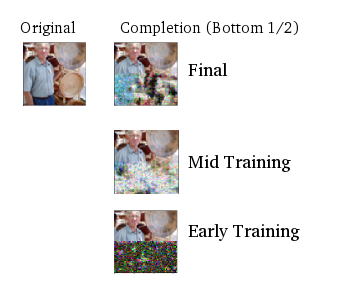

# Training a PixelCNN on Flickr8k images

Regenerate a portion of an image using PixelCNN.


## Example Image



## Dependencies

1. [python 3.5.2](https://www.tensorflow.org/install/)
1. [tensorflow 1.4.1](https://www.tensorflow.org/install/)
1. [cadl](https://github.com/pkmital/pycadl)

## Dataset

[Flickr8k dataset](http://nlp.cs.illinois.edu/HockenmaierGroup/Framing_Image_Description/KCCA.html), 8000 images 64x64 pixels


## Training

### Hyperparameters
The batch size is set to 4 for a 2GB GPU. It should be increased to 32 or greater to leverage the full size of your GPU memory.


Execute training:

```
python pixelcnn_flickr8k.py
```

## Monitor Training

Execute to view loss chart and audio synthesis:

```
tensorboard --logdir=.
```


## Synthesizing
Select an image from the dataset, zero out the lower half and use the trained model to synthesize it.

```
import pixelcnn_flickr8k
pixelcnn_flickr8k.generate()
```
